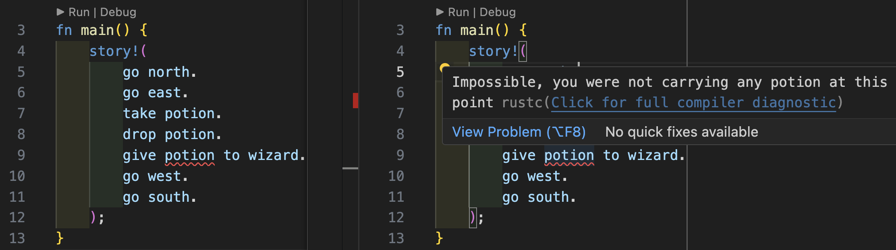

# Macros

This project defines a Domain Specific Language ([DSL](https://en.wikipedia.org/wiki/Domain-specific_language)) that is in the style of old text adventures, like [Zork](https://en.wikipedia.org/wiki/Zork).

## Come see me talk about this in more detail

You can see me going into this spike in more depth on [Twitch](https://twitch.tv/letsseethecode).

* 📅 Monday 29th April 2024
* 🕰️ 6:30pm UK time (1:30 EST, 10:30 PST)
* 📍 https://twitch.tv/letsseethecode

## How to run

```
cargo run
```

## Details

You write your story like this.

```rust
    story!(
        go north.
        go east.
        take potion.
        drop potion.
        go west.
        go south.
    );
```

The story is made of any number of the following lines, terminated by a `.`:
* `go <north|east|south|west>`
* `take <item>`
* `drop <item>`
* `give <item> to <person>`

When you run the story above, you will see the following output to the console.

```
This is your story!
You headed north.
You headed east.
You took a potion.
You dropped a potion.
You headed west.
You headed south.
The END!
```

The interesting part is that it parses and maintains state for the DSL, meaning
it will refuse to compile if it has entered an illegal state.

The example below demonstrates a compiler error when trying to `give potion to wizard`
caused by the fact that there was a previous `drop potion` command executed.


